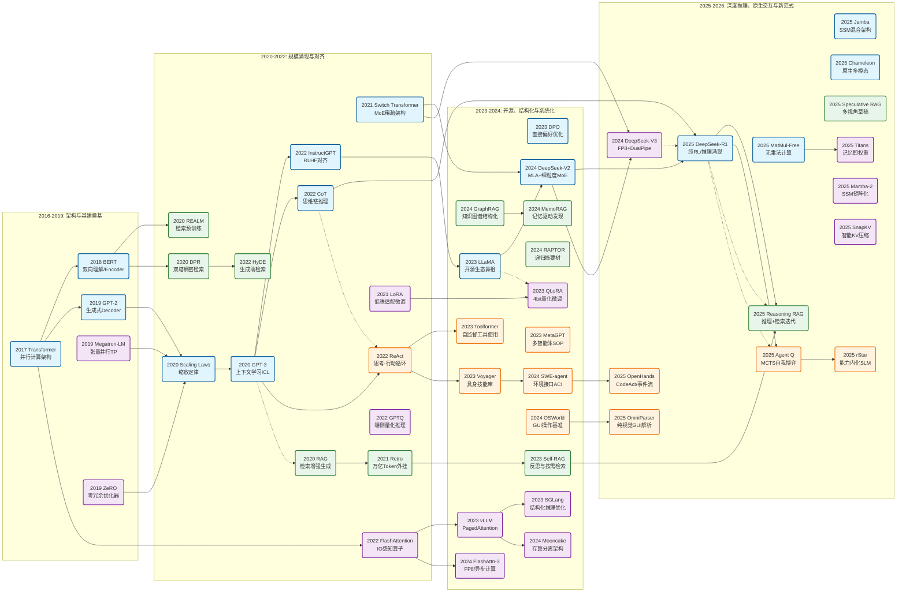

# ClassicPapers_LLMs
hi😊，这个仓库是关于 **大模型领域十年（2016-2026）经典论文全景汇总**，将利用业余时间持续跟踪和优化....。

项目文件分为 “模型和算法”、“rag”、“agent”和“工具、工程创新与优化” 四个视角来分析、总结和跟踪，如果想了解那个具体领域，detail in name.md。

该表格涵盖了**模型与算法**、**RAG（检索增强生成）**、**Agent（智能体）**以及**工具与工程优化**四大核心领域，共计 **60+** 篇里程碑式论文。

---

### **大模型领域经典论文全景总结 (2016 - 2026)**

| 领域 | 年份 | 论文名称 | 作者/机构 | 核心解决问题 | 核心思想与方法 | 历史地位与影响 (自我总结) |
| :--- | :--- | :--- | :--- | :--- | :--- | :--- |
| **模型算法** | 2017 | **Attention Is All You Need** | Google Brain | RNN无法并行计算、长距离依赖弱 | **Transformer架构**：完全基于Self-Attention，抛弃循环结构，引入位置编码。 | **大模型纪元的原点**。定义了现代LLM的骨架，开启并行计算时代。 |
| **模型算法** | 2018 | **BERT** | Google | 模型无法充分利用双向上下文 | **Encoder + MLM**：掩码语言模型预训练，双向理解上下文。 | **理解任务的巅峰**。确立“预训练+微调”范式，Embedding技术基石。 |
| **工程优化** | 2019 | **Megatron-LM** | NVIDIA | 单卡显存装不下超大模型参数 | **张量并行 (TP)**：切分矩阵乘法到多GPU，层内并行。 | **大模型训练基石**。训练千亿参数模型的必备基础设施。 |
| **工程优化** | 2019 | **ZeRO** | Microsoft | 数据并行显存冗余严重 | **零冗余优化器**：切分参数、梯度和优化器状态 (ZeRO-1/2/3)。 | **DeepSpeed核心**。让普通显卡也能训练百亿参数模型。 |
| **模型算法** | 2020 | **Scaling Laws** | OpenAI | 模型性能由什么决定？ | **幂律分布**：性能与算力、数据、参数量呈幂律关系。 | **军备竞赛指导书**。坚定了“大力出奇迹”的路线，催生GPT-3。 |
| **模型算法** | 2020 | **GPT-3** | OpenAI | 微调成本高，缺乏通用性 | **In-Context Learning**：175B参数，无需梯度更新，通过Prompt学习。 | **AGI曙光**。开启提示工程时代，证明了能力涌现（Emergence）。 |
| **RAG** | 2020 | **REALM** | Google | 预训练模型知识固化且难更新 | **检索增强预训练**：在预训练阶段加入检索器，端到端联合优化。 | **RAG思想先驱**。探索了检索与生成在预训练阶段的深度融合。 |
| **RAG** | 2020 | **DPR** | Meta AI | 关键词检索(BM25)不懂语义 | **双塔稠密检索**：Query和Doc映射到向量空间，计算内积。 | **向量检索基石**。催生了向量数据库产业，语义搜索的标准。 |
| **RAG** | 2020 | **RAG** (原论文) | Meta AI | 幻觉严重、私有数据不可知 | **Retriever+Generator**：定义了检索增强生成的标准架构。 | **领域开山之作**。确立了当前企业级AI应用的主流范式。 |
| **模型算法** | 2021 | **Switch Transformer** | Google | 如何低成本扩大参数容量 | **MoE (混合专家)**：稀疏激活，路由机制选择专家。 | **稀疏架构奠基**。GPT-4、DeepSeek-V3等现代高效模型的鼻祖。 |
| **模型算法** | 2021 | **RoPE** | 追一科技 | 位置编码外推性差 | **旋转位置编码**：通过旋转操作注入相对位置信息。 | **底层算法标配**。LLaMA等几乎所有主流模型都采用的位置编码。 |
| **模型算法** | 2021 | **LoRA** | Microsoft | 全量微调显存成本太高 | **低秩适配**：冻结权重，旁路训练低秩矩阵(BA)。 | **微调平民化神器**。PEFT统治者，繁荣了垂直模型生态。 |
| **RAG** | 2021 | **Retro** | DeepMind | 参数太贵，能否用检索替代 | **万亿Token外挂**：分块检索，将外部数据库作为扩展显存。 | **外挂大脑胜利**。证明检索能力可以换取模型参数量。 |
| **模型算法** | 2022 | **CoT** | Google | 模型逻辑推理能力弱 | **思维链**：Let's think step by step，诱导逐步推理。 | **挖掘深层智能**。揭示了LLM具备推理潜力，打破概率预测刻板印象。 |
| **模型算法** | 2022 | **InstructGPT** | OpenAI | 模型不听指令、有毒 | **RLHF**：SFT+RM+PPO，基于人类反馈的强化学习。 | **ChatGPT灵魂**。解决了对齐难题，确立现代训练标准流程。 |
| **模型算法** | 2022 | **Chinchilla** | DeepMind | 之前的模型训练不充分 | **最优计算比**：参数和数据应等比例增加。 | **高效训练方针**。影响了LLaMA等“小参数大数据”模型的设计。 |
| **工程优化** | 2022 | **FlashAttention** | Stanford | 长序列Attention计算慢、显存爆 | **IO感知/分块**：减少HBM读写，利用SRAM加速。 | **算子优化神作**。长文本时代的物理基础，主流框架默认集成。 |
| **工程优化** | 2022 | **GPTQ** | IST Austria | 端侧推理显存不足 | **4-bit量化**：利用二阶信息补偿误差，逐层量化。 | **端侧部署关键**。让大模型成功“瘦身”跑在消费级硬件上。 |
| **Agent** | 2022 | **ReAct** | Princeton | 只想不做或只做不想 | **Reason+Act**：思考-行动-观察的循环范式。 | **Agent Hello World**。LangChain等框架的底层原理，交互标准。 |
| **RAG** | 2022 | **HyDE** | CMU | Query短且模糊，检索不准 | **假设性文档**：先生成假答案，再用假答案去检索真文档。 | **生成助检索**。逆向思维经典，利用幻觉辅助检索。 |
| **模型算法** | 2023 | **LLaMA** | Meta AI | 高性能模型闭源垄断 | **优质数据+标准架构**：证明小模型大数据也能SOTA。 | **开源界里程碑**。羊驼家族鼻祖，引发开源寒武纪爆发。 |
| **Agent** | 2023 | **Toolformer** | Meta AI | 模型不会用计算器/API | **自监督API学习**：模型自己生成调用并学习。 | **工具使用先驱**。Function Calling的学术源头，让Agent长出了手。 |
| **Agent** | 2023 | **Generative Agents** | Stanford | 缺乏记忆和社交行为 | **斯坦福小镇**：记忆流+反思+规划的架构。 | **社会模拟里程碑**。多智能体涌现与记忆架构的典范。 |
| **Agent** | 2023 | **Voyager** | NVIDIA | 无法终身学习，容易迷路 | **代码即技能**：在Minecraft中通过写代码积累技能库。 | **具身智能突破**。提出了可积累的经验机制，而非仅依赖权重。 |
| **模型算法** | 2023 | **DPO** | Stanford | RLHF训练复杂不稳定 | **直接偏好优化**：跳过Reward Model，直接用偏好数据优化。 | **对齐算法主流**。降低了RLHF门槛，开源社区首选。 |
| **工程优化** | 2023 | **QLoRA** | UW | 个人无法微调大模型 | **4-bit加载+LoRA**：NF4量化，单卡48G训65B模型。 | **硬件壁垒打破者**。让微调走进千家万户。 |
| **工程优化** | 2023 | **vLLM** | UC Berkeley | 推理显存碎片化，并发低 | **PagedAttention**：虚拟内存分页管理KV Cache。 | **推理服务标准**。解决显存碎片，大幅提升推理吞吐量。 |
| **RAG** | 2023 | **Self-RAG** | UW / Meta | 盲目检索，无法判断相关性 | **反思Token**：模型自评是否需要检索、结果是否相关。 | **Agentic RAG**。引入元认知，让RAG具备自我批判能力。 |
| **工程优化** | 2023 | **SGLang** | UC Berkeley | 结构化输出/Agent推理慢 | **RadixAttention**：前缀缓存复用，状态机约束解码。 | **Agent推理引擎**。针对复杂工作流和结构化生成的极致优化。 |
| **工程优化** | 2024 | **Medusa** | Princeton | 推理串行，速度慢 | **多头预测**：在原模型加预测头，一次生成多Token。 | **即插即用加速**。极低成本实现推测解码加速。 |
| **工程优化** | 2024 | **BitNet b1.58** | Microsoft | 矩阵乘法能耗高 | **1.58-bit权重**：将MatMul变为加法，挑战GPU霸权。 | **计算范式颠覆**。为专用推理芯片（LPU）奠定理论基础。 |
| **RAG** | 2024 | **RAPTOR** | Stanford | 碎片化检索，不懂全文逻辑 | **递归摘要树**：构建层级树状结构，支持多粒度检索。 | **长文档理解利器**。解决RAG“只见树木不见森林”的问题。 |
| **RAG** | 2024 | **GraphRAG** | Microsoft | 无法回答全局性/隐秘关联问题 | **知识图谱+社区摘要**：LLM建图，生成社区摘要。 | **结构化RAG标杆**。处理复杂私有数据、发现隐性关系的首选。 |
| **工程优化** | 2024 | **DeepSeek-V2** | DeepSeek | 显存瓶颈、MoE利用率低 | **MLA + DeepSeekMoE**：低秩压缩KV Cache，细粒度专家。 | **架构即工程典范**。MLA成为高效模型标准，极致性价比。 |
| **工程优化** | 2024 | **Mooncake** | Moonshot | 超长文本KV Cache存不下 | **存算分离**：Prefill/Decode分离，分布式KV池。 | **云原生推理未来**。揭示商业级长文本服务的系统架构。 |
| **Agent** | 2024 | **SWE-agent** | Princeton | 真实代码库操作难 | **ACI (Agent接口)**：设计专用Shell/编辑器接口给Agent用。 | **环境设计胜利**。证明优化Agent的“工作台”比优化模型更重要。 |
| **Agent** | 2024 | **OSWorld** | HKU / MIT | 无法操作真实GUI | **多模态操作系统基准**：输入截图，输出键鼠操作。 | **GUI Agent北极星**。定义了从Chat走向Computer Use的形态。 |
| **Agent** | 2024 | **The AI Scientist** | Sakana AI | 科研流程自动化 | **全自动科研**：生成Idea、写代码、实验、写论文、评审。 | **Open-Ended极致**。预示AI从助手向独立研究员进化的未来。 |
| **Agent** | 2024 | **Agentless** | UIUC | Agent架构太复杂且脆弱 | **去Agent化**：用简单的定位-修复流程取代复杂循环。 | **奥卡姆剃刀**。证明精心设计的Workflow往往优于复杂Agent。 |
| **工程优化** | 2024 | **FlashAttention-3** | Princeton | H100异步特性未利用 | **Warp特化/FP8**：利用Hopper架构TMA异步搬运。 | **Hopper时代标准**。榨干H100/B200硬件性能的算子。 |
| **工程优化** | 2024 | **Mamba-2** | Princeton | SSM训练并行度低 | **SSD理论**：证明SSM与Attention对偶，实现矩阵乘法化。 | **非Transformer突围**。让SSM架构具备了工程落地的可能性。 |
| **工程优化** | 2024 | **DeepSeek-V3** | DeepSeek | 万卡集群训练成本高昂 | **FP8 + Dual-Pipe**：FP8混合精度训练，通信计算重叠。 | **HPC工程圣经**。将大模型训练成本降低一个数量级。 |
| **RAG** | 2024 | **MemoRAG** | BAAI | Query模糊，检索南辕北辙 | **记忆模块+线索**：先全记忆生成线索，再精确检索。 | **记忆融合RAG**。模糊了长上下文与RAG的界限，拟人化认知。 |
| **模型算法** | 2025 | **DeepSeek-R1** | DeepSeek | 推理能力依赖昂贵标注数据 | **纯强化学习 (Pure RL)**：通过结果奖励自我博弈，涌现思维链。 | **后训练时代里程碑**。开源界o1时刻，证明推理能力可内生。 |
| **模型算法** | 2025 | **Jamba** | AI21 Labs | Transformer长文效率低 | **混合架构**：Transformer + Mamba (SSM) 混合堆叠。 | **混合架构主流化**。终结Attention独裁，兼顾质量与无限窗口。 |
| **模型算法** | 2025 | **MatMul-Free** | UCSC 等 | 矩阵乘法功耗瓶颈 | **加法网络**：彻底移除MatMul，全加法计算。 | **去GPU化先声**。为低功耗、专用硬件推理铺平道路。 |
| **模型算法** | 2025 | **Chameleon** | Meta AI | 多模态拼接理解力差 | **原生多模态**：图像文本统一Token化，早期融合。 | **多模态大一统**。淘汰拼接式架构，实现Any-to-Any生成。 |
| **模型算法** | 2025 | **Inference Scaling** | OpenAI/Google | 预训练数据耗尽 | **测试时算力缩放**：通过推理时搜索/验证提升智能。 | **Scaling Law第二曲线**。重心从训练算力转向推理算力。 |
| **RAG** | 2025 | **Reasoning RAG** | DeepSeek等 | RAG缺乏逻辑验证 | **System 2 RAG**：检索+长思维链推理+二次检索。 | **RAG终极形态**。从“开卷考试”进化为“开卷研究”。 |
| **Agent** | 2025 | **Agent Q** | MultiOn | Agent只会预测下一步 | **MCTS+DPO**：引入蒙特卡洛树搜索和自我博弈规划。 | **System 2 Agent**。Agent领域的AlphaGo时刻，学会三思而后行。 |
| **Agent** | 2025 | **OmniParser** | Microsoft | Agent看不懂屏幕截图 | **纯视觉解析**：将截图转为结构化数据，不依赖HTML。 | **GUI Agent之眼**。解决通用性问题，Pixel-to-Action的基础。 |
| **Agent** | 2025 | **OpenHands** | UIUC | Agent缺乏统一运行时 | **CodeAct范式**：代码即行动，事件流架构。 | **AI程序员操作系统**。确立Code as Action为交互标准。 |
| **Agent** | 2025 | **rStar** | Microsoft | 小模型写代码逻辑差 | **MCTS自博弈**：生成推理轨迹反向微调小模型。 | **Agent能力内化**。将复杂的Agent搜索过程内化为模型直觉。 |
| **工程优化** | 2025 | **SnapKV** | Fudan | 长文本KV Cache挤爆显存 | **智能压缩**：识别Attention关键簇，无损压缩KV。 | **长文推理瘦身**。从“缓存所有”转向“智能缓存”。 |
| **工程优化** | 2025 | **Titans** | DeepMind | 无法实现真正的无限记忆 | **神经记忆模块**：推理时实时更新权重来记忆信息。 | **记忆工程革命**。提出Context as Weights，超越显存限制。 |

---

### **总结：十年技术演进脉络**

1.  **2016-2019 (奠基期)**: **Transformer** 和 **BERT** 解决了“怎么算”和“怎么懂”的问题；**Megatron/ZeRO** 解决了“怎么训”的问题。
2.  **2020-2022 (爆发期)**: **GPT-3** 和 **Scaling Laws** 指明了“变大”的方向；**RAG** 和 **DPR** 解决了“知识”问题；**ReAct** 诞生了“Agent”概念。
3.  **2023-2024 (应用与优化期)**: **LLaMA** 和 **LoRA** 带来了开源与平民化；**FlashAttention** 和 **vLLM** 极致优化了效率；**GraphRAG** 和 **SWE-agent** 让应用走向深水区。
4.  **2025-2026 (推理与智力进化期)**: **DeepSeek-R1** 和 **Agent Q** 标志着AI学会了“慢思考 (System 2)”；**Native Multimodal** 和 **OmniParser** 让AI有了“原生眼睛”；工程上开始挑战Transformer霸权（**Mamba/Jamba**）和GPU霸权（**MatMul-Free**）。

---

下面是一个**大模型技术演进全景图（2016-2026）**。

这张图将大模型的发展划分为四个关键纪元：
1.  **奠基期 (2016-2019)**：基础设施与架构的诞生。
2.  **爆发与对齐期 (2020-2022)**：Scale Up、能力涌现与人类对齐。
3.  **开源与应用期 (2023-2024)**：技术民主化、结构化与系统优化。
4.  **深度推理与智力进化期 (2025-2026)**：System 2思维、原生交互与计算范式革命。

---

### **大模型十年技术演进全景图 (2016-2026)**

---

### **图解说明：四大技术主线的演进逻辑**

这张图展示了技术如何从单一的点，连成线，最后织成网。

#### **1. 🟦 模型与算法 (Model & Algo)**
*   **主线**：从 **Transformer** (2017) 开始，分裂为 **BERT** (理解) 和 **GPT** (生成) 两条路。
*   **转折点**：
    *   **Scaling Laws (2020)** 确立了“大力出奇迹”，催生了 **GPT-3**。
    *   **InstructGPT (2022)** 引入RLHF，解决了“听不懂人话”的问题。
    *   **LLaMA (2023)** 开启了开源时代。
*   **最新形态**：**DeepSeek-R1 (2025)** 标志着模型从“概率预测 (System 1)”转向“深度推理 (System 2)”，通过纯强化学习涌现思维链。同时 **MatMul-Free** 和 **Jamba** 正在挑战Transformer和GPU的统治地位。

#### **2. 🟩 RAG (检索增强生成)**
*   **主线**：从基于关键词的搜索，进化为基于向量的语义检索 (**DPR**)，再到结构化的知识发现。
*   **转折点**：
    *   **REALM/RAG (2020)** 确立了“外挂知识库”的范式。
    *   **Self-RAG (2023)** 引入了“反思”，让RAG知道什么时候该查，什么时候该信。
    *   **GraphRAG (2024)** 引入知识图谱，解决了“全局理解”难题。
*   **最新形态**：**Reasoning RAG (2025)**，结合了深度推理模型，RAG不再是简单的“查资料”，而是“带着资料进行逻辑研判”。

#### **3. 🟧 Agent (智能体)**
*   **主线**：从简单的 Prompt 循环，进化为会用工具、会协作、能操作电脑的实体。
*   **转折点**：
    *   **ReAct (2022)** 是Agent的“Hello World”，确立了“思考-行动”循环。
    *   **Toolformer (2023)** 让Agent学会了用计算器和API。
    *   **SWE-agent / OSWorld (2024)** 让Agent深入到了代码库和操作系统层面。
*   **最新形态**：**Agent Q (2025)** 和 **OmniParser**。Agent开始具备类似AlphaGo的**自我博弈规划能力**，并且拥有了**原生的视觉**来操作GUI，不再依赖人类喂给它的文本接口。

#### **4. 🟪 工具与工程 (Engineering)**
*   **主线**：解决“存不下”、“算得慢”、“太贵了”三个核心问题。
*   **转折点**：
    *   **Megatron/ZeRO (2019)** 让训练千亿模型成为可能。
    *   **FlashAttention (2022)** 突破了长文本的物理瓶颈。
    *   **vLLM (2023)** 解决了推理时的显存碎片问题，成为工业标准。
    *   **DeepSeek-V3 (2024)** 定义了万卡集群 **FP8训练** 的新标准。
*   **最新形态**：**Titans (2025)** 和 **SnapKV**。工程优化开始触及算法本质，尝试通过“记忆即权重”实现无限上下文，并为非Transformer架构（如Mamba-2）铺平道路。

### **总结**
这十年是AI从**感知**走向**认知**，从**单一模型**走向**复杂系统**的十年。2026年的我们，正站在**深度推理（Reasoning）**与**新计算范式（Post-GPU）**爆发的前夜。